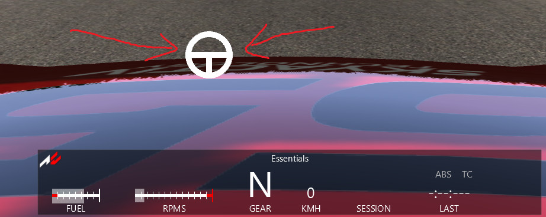

# Assetto Corsa Virtual Wheel


<screenshot here>

This is a Python widget for Assetto Corsa that renders a basic wheel that illustrates the current sheering angle input.

## Installation
Installation steps are no different to installing any other Python widget.

1. Extract the contents of `virtualwheel.zip` to `GAME_DIRECTORY`
2. Check that a directory named `GAME_DIRECTORY/apps/python/virtualwheel` exists
3. Enable this plugin in game settings. From game main menu: `Options` > `General` > `UI Modules`. Check `virtualwheel`.
4. Enter a session
5. Select `Virtual Wheel` from the widget list

## Release notes
v0.1: initial release

## Contributing
Always keen on PRs to improve this plugin with new features or bug fixes no matter how small.
1. Clone repo to disk
2. Set up `Pipenv` (see below) 
3. Make changes to source files in `src.py`
4. Make sure tests and linters pass (see below)
5. Create PR! 
6. PR gets reviewed and merged maybe. Thanks!

## Development environment setup
1. Install `Pipenv` https://pipenv.pypa.io/en/latest/
2. ... TODO: finish these instructions

## Testing your changes (WIP)
TODO: set up automated regression tests
```
cd src
python test.py
```
A pygame window will open and display a wheel rotating. If it is not a wheel rotating, then something's not right!

Testing on target Python version in Docker: 
```
sudo docker build -t lol . && sudo docker run -it lol python test.py
```
